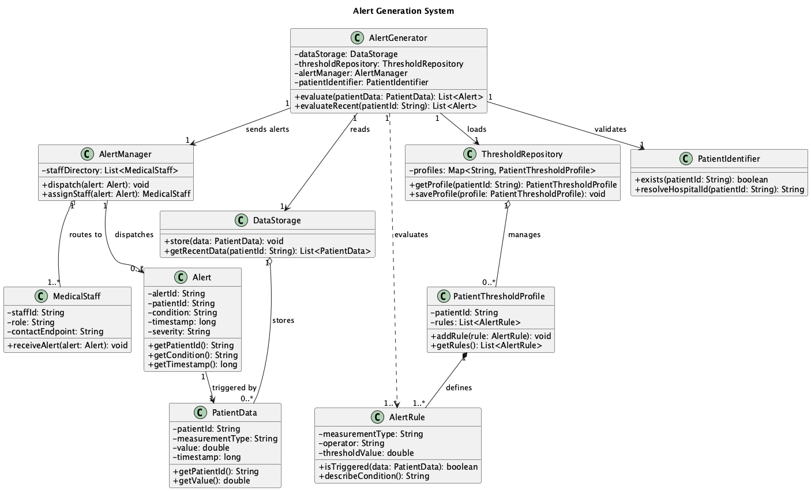
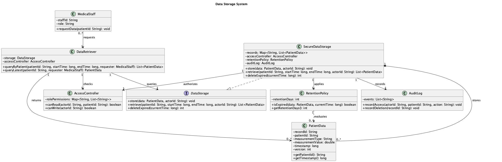
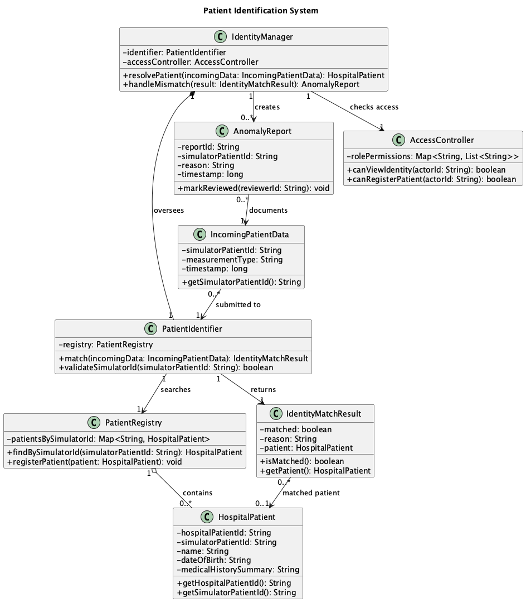
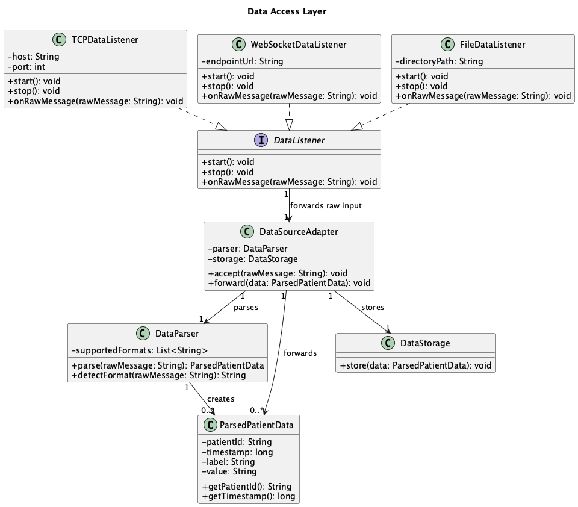
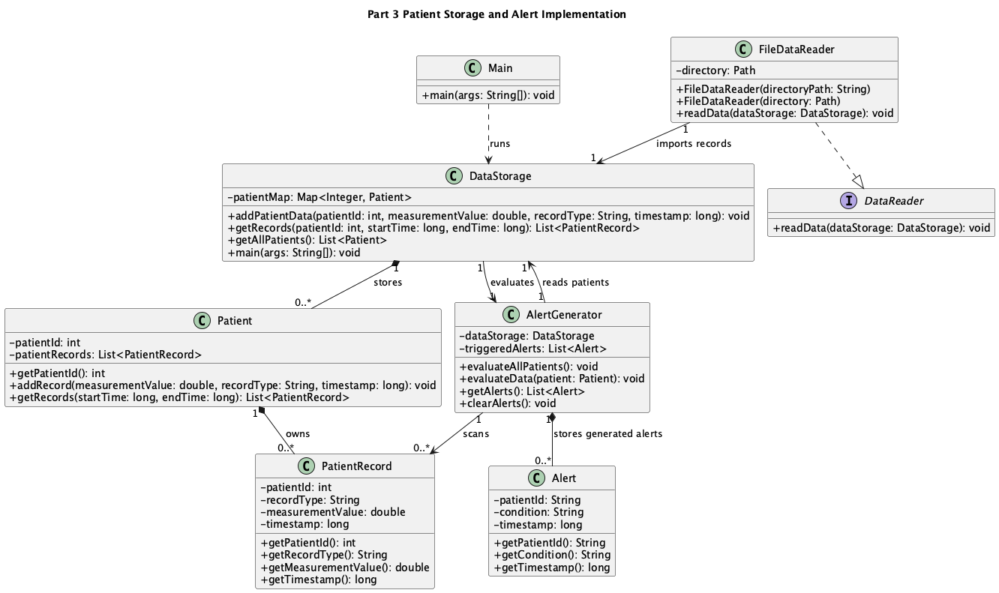

# CHMS UML Models

This directory contains the UML class diagrams for Part 2 of the CHMS project. The diagrams are design blueprints for the intended monitoring system and use the current signal project as context, but they also include planned classes that are not fully implemented in the Java code yet.

## Alert Generation System

The Alert Generation System models how incoming patient measurements become clinical alerts. The design starts with `AlertGenerator`, which receives or retrieves `PatientData`, validates the patient through `PatientIdentifier`, loads patient-specific thresholds from `ThresholdRepository`, and evaluates the data against one or more `AlertRule` objects. This keeps evaluation logic separate from routing logic: `AlertGenerator` decides whether an alert exists, while `AlertManager` decides which `MedicalStaff` member receives it.

Personalized thresholds are represented by `PatientThresholdProfile`, which is composed of one or more `AlertRule` instances. Composition is used because a profile owns its rules; if the profile is removed, those patient-specific rules should not continue independently. `ThresholdRepository` aggregates profiles because it manages many profiles but does not represent a clinical rule itself. `DataStorage` is associated with many `PatientData` records so the alert generator can evaluate recent or historical values, not just one measurement.

All sensitive fields, such as patient IDs, thresholds, and staff contact endpoints, are private. Access is provided through focused public methods. This supports encapsulation and prevents unrelated subsystems from changing alert state directly. The model also separates alert creation from dispatching, making it easier to add new alert rules, routing channels, or escalation policies without changing the data storage or patient identity subsystems.

## Data Storage System

The Data Storage System models secure storage and retrieval of timestamped patient measurements. `DataStorage` is shown as an interface so the rest of the CHMS can depend on storage behavior without knowing the concrete implementation. `SecureDataStorage` implements that interface and owns the stored `PatientData` records. Composition is used because records are managed as part of the storage lifecycle: when expired records are deleted, storage controls that deletion through `RetentionPolicy`.

`PatientData` represents one versioned vital-sign record with a patient ID, measurement type, value, timestamp, and version. The version attribute supports traceability when readings are corrected or replaced. `DataRetriever` handles medical-staff queries rather than letting staff access storage directly. This keeps retrieval rules in one place and makes it possible to add filtering, summaries, or trend queries later.

Access control is explicit. `AccessController` checks whether an actor can read or write patient data before storage or retrieval occurs. `AuditLog` records access and deletion events so sensitive operations remain traceable. `RetentionPolicy` decides when old data should be removed, separating deletion rules from storage mechanics. All stored data and permission maps are private, while public methods expose only the operations needed by other subsystems. This design supports privacy, historical analysis, and future replacement of the storage backend without changing the alert or data access layers.

## Patient Identification System

The Patient Identification System models how simulator IDs are matched to real hospital patients. `IncomingPatientData` contains the simulator patient ID that arrives with a measurement. `PatientIdentifier` validates that ID and searches `PatientRegistry` for a matching `HospitalPatient`. The result is wrapped in `IdentityMatchResult`, which records whether a match succeeded and why. This avoids returning `null` as the only mismatch signal and gives the rest of the system a clear object to inspect.

`IdentityManager` coordinates the subsystem. It owns the `PatientIdentifier`, checks permissions through `AccessController`, returns the resolved `HospitalPatient` when matching succeeds, and creates an `AnomalyReport` when the incoming ID cannot be matched or looks suspicious. This placement keeps mismatch handling out of lower-level parsing and storage classes. The registry aggregates many hospital patient records because it manages access to existing records rather than creating clinical identity by itself.

Privacy is central in this diagram. `HospitalPatient` contains sensitive attributes such as name, date of birth, and medical history summary, all marked private. Public access is limited to targeted methods, and identity viewing or registration is controlled by `AccessController`. This design makes each data point traceable to a patient while still isolating identity management from alert rules and raw data listening. It also gives the system a clear path for handling edge cases such as unknown simulator IDs, duplicate mappings, or unreviewed anomalies.

## Data Access Layer

The Data Access Layer models the boundary between the external signal generator and the CHMS. The assignment states that simulator data may arrive through TCP, WebSocket, or log files, so the diagram uses a `DataListener` interface with three implementations: `TCPDataListener`, `WebSocketDataListener`, and `FileDataListener`. Each listener has the same public lifecycle methods and forwards raw messages through the same path. This lets the rest of the CHMS stay independent from the transport protocol.

`DataSourceAdapter` is the central adapter between listeners and storage. It accepts raw strings, calls `DataParser`, receives `ParsedPatientData`, and forwards the standardized result to `DataStorage`. `DataParser` owns format detection and parsing, so listeners do not need to understand CSV, JSON, or any future message format. `ParsedPatientData` holds the normalized fields that every downstream subsystem expects: patient ID, timestamp, label, and value.

The interface relationship between `DataListener` and its implementations supports extension: a future Bluetooth or database listener could be added without changing storage or alert generation. Multiplicity shows that one adapter can process many parsed data points over time, while each listener forwards into one adapter. Attributes such as file paths, endpoints, and ports are private so connection details remain encapsulated. The design provides a clean, replaceable boundary around external input and keeps parsing separate from persistence.

## Part 3 Implementation Diagram

This additional diagram documents the implemented Part 3 code path for patient storage and alert evaluation.
